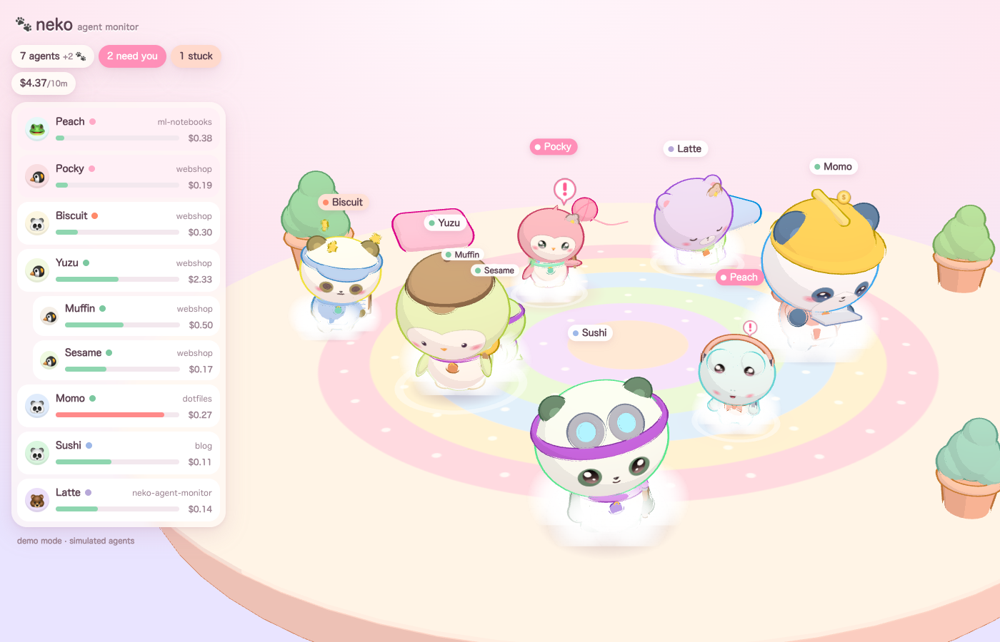
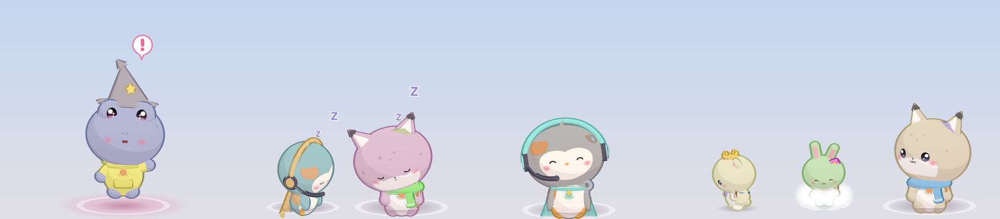

# neko-agent-monitor (=^･ω･^=)

**Every AI agent running on your Mac becomes a kawaii chibi animal on your screen.**
Five agents running → five different kitties wandering around. Each one's look
comes from the prompt that started it. Its size, animation and props come from
live monitoring data. You can tell at a glance which agent needs you, which is
stuck, and which is burning tokens.

Works with **Claude Code**, **OpenAI Codex CLI** and the **OpenAI Agents SDK**.
It's 100 % local: a tiny stdlib-Python daemon plus a three.js page, with an
optional Electron desktop overlay.

| The room (browser) | The overlay (desktop) |
|---|---|
|  |  |

## Quick start

```bash
git clone https://github.com/TonyPeng-2018/neko-agent-monitor && cd neko-agent-monitor
./scripts/install.sh          # venv + model + launchd agent (auto-starts at login)
open http://127.0.0.1:8765/
```

Or run it by hand:

```bash
python3 -m neko serve --open          # real agents   (no install needed, stdlib only)
python3 -m neko serve --demo --open   # fake agents, great for a first look
python3 -m neko status                # cute table in the terminal
make overlay                          # cats walking along the bottom of your desktop
```

| Command | What it does |
|---|---|
| `neko serve [--port N] [--demo] [--open]` | daemon + web UI on `127.0.0.1:8765` |
| `neko status [--json]` | live agents (asks the daemon, or reads the collectors directly) |
| `neko install` / `neko uninstall` | launchd LaunchAgent `com.neko-agent-monitor` (RunAtLoad, KeepAlive) |
| `neko hooks install\|uninstall\|status [--codex]` | opt-in hooks for instant updates |
| `neko fetch-model` | pre-download the embedding model (then launchd runs with `HF_HUB_OFFLINE=1`) |

Needs Python ≥ 3.9. The core has no dependencies. `pip install -e '.[embed]'`
adds [model2vec](https://github.com/MinishLab/model2vec) for smarter personas.
Without it, a deterministic hashing fallback is used.

## How states map to animations

| Signal | Your kitty… |
|---|---|
| agent created | pops in with a spawn puff |
| creation prompt | picks species, hat, fur colour/pattern, outfit, face, prop and name |
| `working` | walks around. Types on a mini laptop (Edit/Write), holds a magnifier (Read/Grep), swings a hammer (Bash) |
| `waiting` (permission / question) | hops, waves and shows a **"!"** bubble with a glow. This state gets top priority |
| `idle` | sits, blinks slowly, watches your cursor |
| `sleeping` (quiet > 10 min) | curls up, Zzz |
| `error` / stuck loop | dizzy spiral eyes with orbiting stars |
| `done` | confetti, then waves goodbye and walks off |
| context used | body size (0.7×–1.6×). Over 80 % full, a sweat drop appears |
| cost in the last 10 min | coins pop above its head. High burn → steam puffs |
| todo progress | tiny progress ring under its feet |
| subagents | kittens (0.55×, parent's colours) following the parent |
| source | collar tag: Claude = warm, Codex = mint, Agents SDK = lilac |

## Privacy

- **Local only.** The daemon binds `127.0.0.1` and makes no network calls
  (except the one-time model download from Hugging Face, which you can skip).
  Requests with a foreign `Host` or `Origin` get a 403, which protects against
  DNS rebinding and cross-site POSTs. Request bodies are capped at 1 MB.
- **Prompts are read locally**, from the transcripts your agents already write,
  to seed each character's look and to show the task in a tooltip.
- **Only hashes + traits are persisted.** `~/.neko/personas.json` maps
  `sha256(prompt)` → look (colours, hat, name…). Prompt text is never stored.
- neko never writes to `~/.claude` or `~/.codex`. The only exception is the
  opt-in `neko hooks install`, which backs up the file first.

## How it works

```
 Claude Code ─┐ ~/.claude/sessions/*.json (live registry)
              │ ~/.claude/projects/**/<sid>.jsonl (+ subagents/agent-*.jsonl)
 Codex CLI  ──┤ ~/.codex/sessions/YYYY/MM/DD/rollout-*.jsonl + `ps` liveness
 Agents SDK ──┤ neko_tracing.NekoTracingProcessor → POST /api/ingest
 hooks (opt)──┘ POST /api/event  (Claude/Codex hook shim, instant state changes)
        │
        ▼
  neko daemon (Python stdlib http.server, 127.0.0.1:8765)
   collectors/  → list[Agent]  (neko/model.py is the contract)
   persona.py   → Agent.persona  (embedding of creation prompt → traits)
   server.py    → GET /api/agents, GET /api/stream (SSE), static web/
        │
        ▼
  web/ (three.js procedural toon chibis, no build step)
   ├─ browser tab: "room" mode with HUD list + detail card
   └─ overlay/ Electron: transparent, click-through, always-on-top, cats walk
      along the bottom of the desktop; hover a cat for its card
```

API: `GET /api/agents` returns a snapshot `{generated_at, agents[], totals}`.
`GET /api/stream` is Server-Sent Events: it pushes only when something changed
and sends a `: ping` every 15 s. `GET /api/health` reports daemon status.
`POST /api/event` takes hook payloads. `POST /api/ingest` takes Agents SDK spans.

## Hooks (opt-in, optional)

Hooks aren't required. Without them, neko polls session files every 2 s, and
Claude's `~/.claude/sessions/*.json` already records whether a session is
busy, idle or waiting. Hooks just make state changes show up instantly.

```bash
neko hooks install            # Claude Code: ~/.claude/settings.json
neko hooks install --codex    # + Codex CLI:  ~/.codex/hooks.json
neko hooks status
neko hooks uninstall          # removes only neko's entries
```

- **Claude Code** gets `type: "http"` hooks that POST straight to
  `http://127.0.0.1:8765/api/event` with a 2 s timeout. Events: SessionEnd,
  UserPromptSubmit, PreToolUse, PostToolUse, PostToolUseFailure,
  PermissionRequest, Notification, Stop, StopFailure, SubagentStart,
  SubagentStop, PreCompact. Claude Code treats connection errors and timeouts
  of http hooks as non-blocking, and neko replies with an empty 204 ("no
  decision"), so a stopped daemon never gets in your way. `SessionStart` only
  allows command hooks, so it runs `scripts/neko-hook.py` asynchronously.
- **Codex CLI** has the same `hooks.json` shape, using command hooks that run
  `scripts/neko-hook.py --source codex`. The shim reads the hook JSON on stdin,
  POSTs it with a 0.3 s timeout, prints nothing and **always exits 0**.
  To add it by hand, put this in `~/.codex/hooks.json`, with one entry per event
  (`SessionStart`, `UserPromptSubmit`, `PreToolUse`, `PermissionRequest`,
  `PostToolUse`, `Stop`, …):
  ```json
  {"hooks": {"Stop": [{"hooks": [{"type": "command", "timeout": 2,
     "command": "python3 /path/to/neko-agent-monitor/scripts/neko-hook.py --source codex"}]}]}}
  ```
- Every edit backs up to `settings.json.neko-bak` / `hooks.json.neko-bak` first,
  keeps all your other hooks, and is idempotent. Restart running agents (or open
  `/hooks` in Claude Code) to pick the changes up.

## Desktop overlay

```bash
cd overlay && npm install && npm start      # or: make overlay
```

The overlay is a transparent, frameless, always-on-top window (`screen-saver`
level) covering your main display's work area. It shows on every Space,
including fullscreen apps, and has no Dock icon. Clicks pass through to your
desktop, except when you hover a cat: the page calls `window.neko.setHover(true)`
to catch the mouse. The menu-bar cat offers **Show room**, **Show/Hide
overlay** and **Quit**. If the daemon isn't up yet, the overlay retries every
3 s. Set `NEKO_PORT` if you changed the port.

## Background service (launchd)

`neko install` writes `~/Library/LaunchAgents/com.neko-agent-monitor.plist`
(`python -m neko serve` with your current Python, `RunAtLoad`, `KeepAlive`, logs
in `~/Library/Logs/neko-agent-monitor.log`) and loads it with
`launchctl bootstrap gui/$UID`. `neko uninstall` runs `launchctl bootout` and
removes the plist. Run `neko fetch-model` before `neko install` and the service
runs fully offline (`HF_HUB_OFFLINE=1`).

Environment overrides: `NEKO_PORT`, `NEKO_HOME` (default `~/.neko`),
`CLAUDE_CONFIG_DIR` (default `~/.claude`), `CODEX_HOME` (default `~/.codex`),
`NEKO_POLL` (seconds, default 2).

## 中文简介

**neko-agent-monitor** 把你 Mac 上运行的每一个 AI Agent（Claude Code、Codex CLI、OpenAI Agents SDK）变成一只可爱的 Q 版小动物。
外观（物种、帽子、毛色、道具、名字）由创建它的提示词的语义向量决定。体型、动作和道具反映实时监控数据：
需要你确认权限时会挥手并冒出 “!”，出错时转圈圈眼，长时间空闲会蜷起来睡觉，子 Agent 是跟在后面的小猫崽。

- 快速开始：`./scripts/install.sh`，然后打开 http://127.0.0.1:8765/ 。想先看效果可以运行 `python3 -m neko serve --demo --open`
- 桌面悬浮层：`make overlay`（透明、鼠标穿透、始终置顶）
- 隐私：完全本地运行。提示词只在本机读取，持久化的只有哈希和外观特征
- Hooks 是可选项：`neko hooks install`，修改前会先备份 `settings.json`

## Credits / borrowed, not reinvented

| What | From | License |
|---|---|---|
| hook → local daemon event design, state vocabulary | Pixel Agents, agent-pet-runtime, claude-pet | MIT (ideas + small snippets with attribution) |
| state set & idle→sleep timing | Clawd on Desk | AGPL — ideas only, **no code** |
| embedding model | model2vec potion-multilingual-128M | MIT |
| toon outline | three.js `OutlineEffect` addon | MIT |
| Codex pet pack format (`~/.codex/pets`) | OpenAI Codex | format only (import later) |

## License

MIT © 2026 TonyPeng-2018. See [LICENSE](LICENSE).
