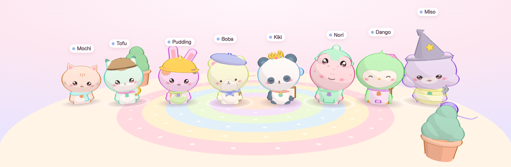

# neko-agent-monitor (=^･ω･^=)

**Every AI agent running on your Mac becomes a kawaii chibi animal on your screen.**
Five agents running → five different kitties wandering around. Each one's look
comes from the prompt that started it. Its size, animation and props come from
live monitoring data. You can tell at a glance which agent needs you, which is
stuck, and which is burning tokens.

Works with **Claude Code**, **OpenAI Codex CLI** and the **OpenAI Agents SDK**.
It's 100 % local: a tiny stdlib-Python daemon plus a three.js page, with an
optional Electron desktop overlay.




## Quick start

```bash
git clone https://github.com/TonyPeng-2018/neko-agent-monitor && cd neko-agent-monitor
./scripts/install.sh          # .venv + pip install -e '.[embed]' + model + launchd agent
open http://127.0.0.1:8765/
```

`install.sh` does the same thing as these steps, which you can also run by hand:

```bash
python3 -m venv .venv && . .venv/bin/activate
pip install -e '.[embed]'     # core is stdlib-only; [embed] adds model2vec for smarter looks
neko fetch-model              # one-time download of the embedding model (~500 MB)
neko install                  # launchd LaunchAgent: starts at login, restarts if it dies
neko hooks install            # optional: instant updates from Claude Code (backs up settings.json)
cd overlay && npm install && npm start   # optional: cats walking on your desktop
```

To try it without installing anything:

```bash
python3 -m neko serve --open          # real agents   (stdlib only)
python3 -m neko serve --demo --open   # fake agents, great for a first look
python3 -m neko status                # cute table in the terminal
```

| Command | What it does |
|---|---|
| `neko serve [--port N] [--demo] [--open]` | daemon + web UI on `127.0.0.1:8765` |
| `neko status [--json]` | live agents (asks the daemon, or reads the collectors directly) |
| `neko install` / `neko uninstall` | launchd LaunchAgent `com.neko-agent-monitor` (RunAtLoad, KeepAlive) |
| `neko hooks install\|uninstall\|status [--codex]` | opt-in hooks for instant updates |
| `neko fetch-model` | pre-download the embedding model (then launchd runs with `HF_HUB_OFFLINE=1`) |
| `make overlay` | desktop overlay (Electron). `make demo`, `make test` also exist |

Needs Python ≥ 3.9 on macOS. Without `[embed]`, a deterministic hashing
embedding is used instead of [model2vec](https://github.com/MinishLab/model2vec):
every agent still gets a stable, prompt-dependent look, just less "semantic".

Web page URL options: `?demo=1` (built-in fake agents, `&n=30` for a crowd),
`?gallery=1` (species line-up, `&hat=wizard` etc.), `?debug=1` (draw-call stats).

## How states map to animations

| Signal | Your kitty… |
|---|---|
| agent created | pops in with a spawn puff |
| creation prompt | picks species, hat, fur colour/pattern, outfit, face, prop and name |
| `working` | toddles around, then stops to use its prop: types on a mini laptop, sweeps a magnifier, paints, swings a bug net, scribbles with a quill… (the prop comes from the prompt's role) |
| `waiting` (permission / question) | hops, waves and shows a **"!"** bubble with a glow. This state gets top priority |
| `idle` | sits, blinks slowly, watches your cursor |
| `sleeping` (quiet > 10 min) | curls up, Zzz |
| `error` / stuck loop | dizzy spiral eyes with orbiting stars |
| `done` | confetti, then waves goodbye and walks off |
| context used | body size (0.7×–1.6×). Over 80 % full, a sweat drop appears |
| cost in the last 10 min | coins pop above its head. High burn → steam puffs |
| todo progress | tiny progress ring under its feet |
| subagents | kittens (0.55×, parent's colours) following the parent |
| source | collar tag: Claude = warm, Codex = mint, Agents SDK = lilac |

Two agents on screen never share a name: if two prompts hash to the same
name (identical sibling subagents, say), the newcomer takes the next free one.
A crowd spreads over the island, the camera frames whoever is there, and
everyone shrinks a little when the island gets full.

## Monitoring details

**Where agents come from** (no hooks needed): Claude Code's live registry
`~/.claude/sessions/<pid>.json` (checked against the process table so stale
files are ignored) plus its transcripts and `subagents/agent-*.jsonl`;
Codex CLI rollouts in `~/.codex/sessions/**` plus `ps`/`lsof` liveness and
`state_5.sqlite` for the subagent tree; OpenAI Agents SDK runs pushed by
`neko.collectors.sdk_client.NekoTracingProcessor`. Foreground, background,
`claude -p` and subagents all show up. Polled every 2 s, pushed over SSE.

| State | Claude Code | Codex CLI | Agents SDK |
|---|---|---|---|
| `working` | registry `busy`, or a subagent file written in the last 2 min / a tool still running | `task_started` without `task_complete` | span open |
| `waiting` | registry `waiting` (`waitingFor`: permission prompt, input needed, dialog…) or a `PermissionRequest` hook | approval request in the rollout, or a `PermissionRequest` hook | — |
| `idle` | registry `idle` | turn complete, process alive | — |
| `sleeping` | idle > 10 min, or a `/loop` wakeup is scheduled | idle > 10 min | — |
| `error` | API error that persists (≥ 3 retries or > 90 s), or the same tool call ≥ 6 of the last 12 | same | span error |
| `done` | subagent handed back / process exited (shown 20–60 s, then it walks off) | process exited | trace finished |

| Number | Meaning |
|---|---|
| `context_tokens` / `context_pct` | prompt size of the latest model call (input + cache read + cache write) over the model's window (1 M for `[1m]` / 1M-context models, else 200 k; Codex reports its own). Resets on `/compact` |
| `cost_usd` | API-list-price equivalent of the whole session (Claude's own `cost-state` when present, else computed from usage) — not your subscription bill |
| `cost_10m` | spend in the last 10 minutes (the burn rate; > $1.50 → steam puffs, ≥ $2 → `burn` flag) |
| `tokens_in` / `tokens_out` | cumulative tokens, cache reads included |
| `tool_count`, `last_tool` | tool calls so far and the latest one |
| `progress_done/total` | TodoWrite / Task list progress (the ring under the feet) |
| flags | `repeat` (stuck loop), `poll` (sleep-polling), `loop` (/loop, crons), `burn`, `context` (near compaction or huge), `longtool` (one tool running > 20 min), `quiet` (busy but silent > 15 min), `toolfail`, `partial` (huge transcript, totals cover the tail) |

Click a character (or a row in the list) for its card: prompt, current
activity, context bar, cost, model, tools, todos, flags and working directory.

## Privacy

- **Local only.** The daemon binds `127.0.0.1` and makes no network calls
  (except the one-time model download from Hugging Face, which you can skip).
  The web page and overlay load nothing from the internet either: three.js is
  vendored in `web/vendor/`, fonts are system fonts, and a CSP pins everything
  to the local origin. Requests with a foreign `Host` or `Origin` get a 403,
  which protects against DNS rebinding and cross-site POSTs. Bodies are capped at 1 MB.
- **Prompts are read locally**, from the transcripts your agents already write,
  to seed each character's look and to show the task in the card. They are
  never sent anywhere and never written to disk by neko.
- **Only hashes + traits are persisted.** `~/.neko/personas.json` (mode 600)
  maps `sha256(prompt)` → look (colours, hat, name…). Prompt text is never stored.
- neko never writes to `~/.claude` or `~/.codex`. The only exception is the
  opt-in `neko hooks install`, which backs up the file first and only ever
  adds/removes its own entries.
- Light in the background: the daemon idles at ~50 MB and well under 1 % CPU.
  The embedding model (~1.5 GB in RAM) runs in a child process that only
  exists while new agents are being dressed up and exits after 90 s idle
  (`NEKO_EMBED_IDLE`).

## How it works

```
 Claude Code ─┐ ~/.claude/sessions/*.json (live registry)
              │ ~/.claude/projects/**/<sid>.jsonl (+ subagents/agent-*.jsonl)
 Codex CLI  ──┤ ~/.codex/sessions/YYYY/MM/DD/rollout-*.jsonl + `ps` liveness
 Agents SDK ──┤ neko_tracing.NekoTracingProcessor → POST /api/ingest
 hooks (opt)──┘ POST /api/event  (Claude/Codex hook shim, instant state changes)
        │
        ▼
  neko daemon (Python stdlib http.server, 127.0.0.1:8765)
   collectors/  → list[Agent]  (neko/model.py is the contract)
   persona.py   → Agent.persona  (embedding of creation prompt → traits)
   server.py    → GET /api/agents, GET /api/stream (SSE), static web/
        │
        ▼
  web/ (vendored three.js r186, procedural toon chibis, no build step)
   ├─ browser tab: "room" mode with HUD list + detail card
   └─ overlay/ Electron: transparent, click-through, always-on-top, cats walk
      along the bottom of the desktop; hover a cat for its card
```

API: `GET /api/agents` returns a snapshot `{generated_at, agents[], totals}`.
`GET /api/stream` is Server-Sent Events: it pushes only when something changed
and sends a `: ping` every 15 s. `GET /api/health` reports daemon status.
`POST /api/event` takes hook payloads. `POST /api/ingest` takes Agents SDK spans.

## Hooks (opt-in, optional)

Hooks aren't required. Without them, neko polls session files every 2 s, and
Claude's `~/.claude/sessions/*.json` already records whether a session is
busy, idle or waiting. Hooks just make state changes show up instantly.

```bash
neko hooks install            # Claude Code: ~/.claude/settings.json
neko hooks install --codex    # + Codex CLI:  ~/.codex/hooks.json
neko hooks status
neko hooks uninstall          # removes only neko's entries
```

- **Claude Code** gets `type: "http"` hooks that POST straight to
  `http://127.0.0.1:8765/api/event` with a 2 s timeout. Events: SessionEnd,
  UserPromptSubmit, PreToolUse, PostToolUse, PostToolUseFailure,
  PermissionRequest, Notification, Stop, StopFailure, SubagentStart,
  SubagentStop, PreCompact. Claude Code treats connection errors and timeouts
  of http hooks as non-blocking, and neko replies with an empty 204 ("no
  decision"), so a stopped daemon never gets in your way. `SessionStart` only
  allows command hooks, so it runs `scripts/neko-hook.py` asynchronously.
- **Codex CLI** has the same `hooks.json` shape, using command hooks that run
  `scripts/neko-hook.py --source codex`. The shim reads the hook JSON on stdin,
  POSTs it with a 0.3 s timeout, prints nothing and **always exits 0**.
  To add it by hand, put this in `~/.codex/hooks.json`, with one entry per event
  (`SessionStart`, `UserPromptSubmit`, `PreToolUse`, `PermissionRequest`,
  `PostToolUse`, `Stop`, …):
  ```json
  {"hooks": {"Stop": [{"hooks": [{"type": "command", "timeout": 2,
     "command": "python3 /path/to/neko-agent-monitor/scripts/neko-hook.py --source codex"}]}]}}
  ```
- Every edit backs up to `settings.json.neko-bak` / `hooks.json.neko-bak` first,
  keeps all your other hooks, and is idempotent. Restart running agents (or open
  `/hooks` in Claude Code) to pick the changes up.

## Desktop overlay

```bash
cd overlay && npm install && npm start      # or: make overlay
```

The overlay is a transparent, frameless, always-on-top window (`screen-saver`
level) covering your main display's work area. It shows on every Space,
including fullscreen apps, and has no Dock icon. Clicks pass through to your
desktop, except when you hover a cat: the page calls `window.neko.setHover(true)`
to catch the mouse. The menu-bar cat offers **Show room**, **Show/Hide
overlay** and **Quit**. If the daemon isn't up yet, the overlay retries every
3 s. Set `NEKO_PORT` if you changed the port.

## Background service (launchd)

`neko install` writes `~/Library/LaunchAgents/com.neko-agent-monitor.plist`
(`python -m neko serve` with your current Python, `RunAtLoad`, `KeepAlive`, logs
in `~/Library/Logs/neko-agent-monitor.log`) and loads it with
`launchctl bootstrap gui/$UID`. `neko uninstall` runs `launchctl bootout` and
removes the plist. Run `neko fetch-model` before `neko install` and the service
runs fully offline (`HF_HUB_OFFLINE=1`).

Environment overrides: `NEKO_PORT`, `NEKO_HOME` (default `~/.neko`),
`CLAUDE_CONFIG_DIR` (default `~/.claude`), `CODEX_HOME` (default `~/.codex`),
`NEKO_POLL` (seconds, default 2).

## 中文简介

**neko-agent-monitor** 把你 Mac 上运行的每一个 AI Agent（Claude Code、Codex CLI、OpenAI Agents SDK，
终端里开的、后台的、`claude -p`、子 Agent 都算）变成一只可爱的 Q 版小动物。

- **外观来自提示词**：用创建它的提示词做语义向量（model2vec 多语言模型，中英文对齐），决定物种、帽子、毛色、花纹、衣服、表情、道具和名字。同一个提示词永远是同一只；同时在场的两只不会重名。
- **监控数据拟人化**：上下文越满体型越大（超过 80% 会冒汗）；最近 10 分钟花的钱变成头顶的金币，烧钱太快会冒蒸汽；需要你确认权限时会跳着挥手、冒出 “!”；出错或卡在循环里会转圈圈眼；长时间空闲会蜷起来睡觉（Zzz）；完成后撒花、挥手离场；子 Agent 是跟在后面的小猫崽；待办进度是脚下的小圆环。
- **安装**：`./scripts/install.sh`（创建 .venv、`pip install -e '.[embed]'`、下载模型、安装 launchd 后台服务，开机自启）。然后打开 http://127.0.0.1:8765/ 。先看效果：`python3 -m neko serve --demo --open`
- **桌面悬浮层**：`cd overlay && npm install && npm start`（透明、鼠标穿透、始终置顶，小动物在屏幕底部走来走去）
- **Hooks（可选）**：`neko hooks install`，状态变化即时显示；修改前会先备份 `settings.json`，卸载只删除 neko 自己的条目
- **隐私**：完全本地运行，网页也不访问外网。提示词只在本机读取，不会写入磁盘；持久化的只有提示词的哈希和外观特征
- **轻量**：后台守护进程约 50 MB 内存、CPU 基本为 0；嵌入模型只在有新 Agent 出现时临时加载，空闲 90 秒后自动退出

## Credits / borrowed, not reinvented

| What | From | License |
|---|---|---|
| hook → local daemon event design, state vocabulary | Pixel Agents, agent-pet-runtime, claude-pet | MIT (ideas + small snippets with attribution) |
| state set & idle→sleep timing | Clawd on Desk | AGPL — ideas only, **no code** |
| embedding model | model2vec potion-multilingual-128M | MIT |
| 3D engine, toon outline, orbit controls | three.js r186 (`OutlineEffect`, `OrbitControls`, vendored in `web/vendor/three`) | MIT |
| desktop overlay shell | Electron | MIT |
| Codex pet pack format (`~/.codex/pets`) | OpenAI Codex | format only (import later) |

## License

MIT © 2026 TonyPeng-2018. See [LICENSE](LICENSE).
